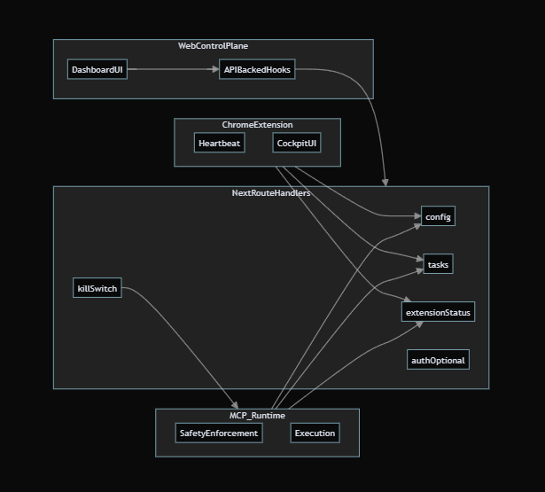

# Glazyr — Web Control Plane (Mission Control, not the cockpit)

Glazyr is building a **safety-first automation stack** where the UI stays calm and the execution stays contained.

This app is the **control plane**: a control surface to **authenticate (dev cookie session for now)**, **configure agent behavior**, **define safety boundaries**, and **monitor status + outcomes**.

## What this web app *is*

- **Configuration**: agent mode (Observe / Assist / Automate), budgets, allowed domains, disallowed actions
- **Trust + safety**: human-in-the-loop thresholds and an **emergency stop**
- **Outcomes**: task summaries and status — **no screenshots, no traces**
- **Extension status**: connection/permissions/heartbeat + **policy enforcement signals** (reported by the extension)

## What this web app is *not* (by design)

- **No chat UI**
- **No freeform “tell the agent what to do”**
- **No automation execution**
- **No chain-of-thought / reasoning display**
- **No direct MCP calls**

If it feels interactive like a cockpit, it’s probably wrong.

## Architecture (separation of responsibility)

- **Control plane (this app)**: config + monitoring
- **Extension (`../glazyr-extension/`)**: local execution + local policy enforcement
- **Runtime (`../runtime-aws/`)**: orchestration backend (task state + action queue)



## Product shape (routes)

- **Public**
  - `/` Home
  - `/how-it-works`
  - `/privacy-security`
  - `/privacy-policy` (Chrome extension privacy policy URL)
  - `/install-extension`
  - `/login`
- **Dashboard**
  - `/dashboard` Overview (mode, extension status, last task summary, **emergency stop**)
  - `/dashboard/agent-modes`
  - `/dashboard/safety-permissions` (**critical**)
  - `/dashboard/task-history` (summaries only)
  - `/dashboard/extension-status`
  - `/dashboard/account`

## Quickstart

```bash
npm install
npm run dev
```

Then open:

- `http://localhost:3000/` (home)
- `http://localhost:3000/dashboard` (dashboard — includes **guest mode**)

## Deploy

### Vercel

This app can be deployed to Vercel to get a shareable HTTPS URL.

- Import the GitHub repo in Vercel
- Use default Next.js settings
- Package manager: **npm** (recommended because `package-lock.json` is present)

> This repo includes route handlers under `app/api/**/route.ts`, so it must be deployed to a platform that supports Next.js server functions.

### AWS

Because this repo contains route handlers (`app/api/**/route.ts`), **static S3 export is not compatible**. Deploy using a Next.js server/SSR-capable platform (e.g., AWS Amplify Hosting, Vercel), or containerize and run behind ALB/CloudFront.

Build:

```bash
npm run build
```

Run:

```bash
npm run start
```

## Current state (important)

- **Auth**: dev cookie session endpoints at `/api/auth/*`
- **Config**: `/api/control-plane/config`
- **Task summaries**: `/api/tasks` (summaries only)
- **Extension status**: `/api/extension/status` (heartbeat/permissions + enforcement signals like `policyEnforced`, `killSwitchEngaged`, etc.)
- **Emergency stop**: `/api/killswitch`

## Vision POC status

The vision-first “cockpit” experience (chat + framed screenshot OCR) currently lives in the **Chrome extension** and the **AWS runtime**:

- Extension framed screenshot capture → `POST /runtime/vision/ocr` (Google Vision OCR)
- OCR output is displayed in the extension widget chat

This web app intentionally remains “mission control” (config + monitoring), and does **not** display screenshots or run OCR itself.

## Non-negotiables

- The web control plane **never executes actions**.
- The web control plane **does not display** screenshots, internal traces, or model reasoning.
- Enforcement lives outside the UI: **runtime + extension**.
